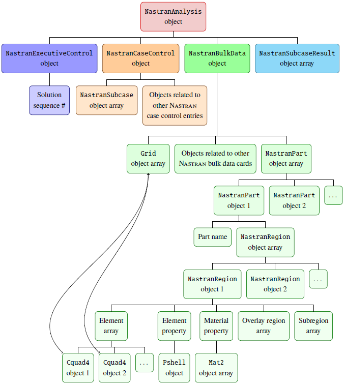

# matlab-4-nastran
Object-oriented Matlab framework for the manipulation of Nastran input models and simulation results.

## Motivation
This project was created as a follow-up of my work for several tasks dealing with aeroelastic analyses with MSC Nastran. The motivation behind the creation and maintenance of this project stems from the desire to have an object-oriented framework to manage input and output data of simulations in Nastran. Such object-oriented framework is considered to give advantages in terms of modularity and flexibility, together with the convenient opportunity to track the dependencies of the elements composing the computational model. A big step towards the formalization of this framework was made while working on a research project at TU Delft involving the design of an aeroelastically tailored wing. This research project ended up in a [paper for SciTech 2020](https://arc.aiaa.org/doi/abs/10.2514/6.2020-1636), where the framework is partially explained.

## Features
The top element in the hierarchy of the object-oriented framework is the `NastranAnalysis` object. This contains everything needed to run analyses and to process the results: the `NastranExecutiveControl` object, where the solution sequence is specified, the `NastranCaseControl` object, where the subcases of the nastran analysis are defined, the `NastranSubcaseResult` object array, where the results are stored and the `NastranBulkData` object, where the numerical model is defined. The two main children of `NastranBulkData` object are an array of `Grid` objects and an array of `NastranPart` objects. The `Grid` objects define all the structural nodes of the numerical model, while the array of `NastranPart` objects defines the different parts of the modelled structure. For example, in a wing these parts may correspond to bottom skin, top skin, spars and ribs. A `NastranPart` object, in turn, contains a name, needed for identification, and an array of `NastranRegion` objects. These correspond to portions of the structure having the same material properties. A `NastranPart` object may contain several `NastranRegion` objects. For example the top skin of a composite wing may be composed by several spanwise and chordwise laminates. The three main attributes of a `NastranRegion` object are the `ElementArray`, the `ElementProperty` and the `MaterialProperty`. The first component includes objects representing structural elements (e.g. `Cquad4` objects) and corresponding to analogous Nastran cards. The structural element objects are linked to the `Grid` objects forming each structural element. The `ElementProperty` contains a property object (e.g. `Pshell`), which defines properties of all the structural elements belonging to the `NastranRegion` object. The `MaterialProperty` is made of a material object (e.g. `Mat2`) which defines the properties of the material associated to the structural elements of the `NastranRegion`.

An illustration of the structure of the object-oriented framework is given in the figure below.



## Installation
***Warning: you must have Nastran already installed in your computer to use the framework!***

1. Download the package to a local folder (e.g. ~/matlab-4-nastran/) by running: 
```console
git clone https://github.com/fmamitrotta/matlab-4-nastran.git
```
2. Run Matlab and add the folder (~/matlab-4-nastran/) to your Matlab path.

3. Try some of the example scripts to get an understanding of the framework. Enjoy!

## Contributing
Please don't hesistate to throw feedback and suggestions. Pull requests are welcome. For major changes, please open an issue first to discuss what you would like to change.

## License
[GPL-3.0](https://choosealicense.com/licenses/gpl-3.0/)
